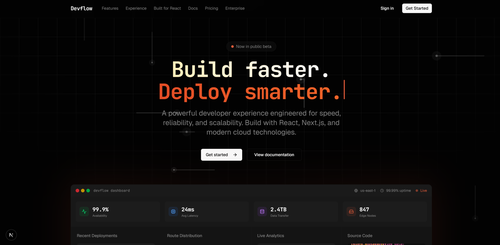

# DevFlow — Modern SaaS Landing Page



DevFlow is a premium, high-performance SaaS landing page template designed for developer-centric products. Engineered for speed, reliability, and scalability, it provides a stunning first impression with modern aesthetics and interactive components.

[Live Demo](https://github.com/kuruminyx/Dev-Flow-Saas-landing-page) | [Documentation](https://github.com/kuruminyx/Dev-Flow-Saas-landing-page)

---

## ✨ Features

- **🚀 High Performance**: Built with Next.js 15+ and React 19 for lightning-fast load times.
- **🎨 Premium Design**: Modern dark-mode aesthetic with glassmorphism, smooth gradients, and interactive canvas backgrounds.
- **📊 Interactive Dashboard**: A live-preview dashboard showing real-time analytics, deployment status, and route distribution.
- **📱 Fully Responsive**: Seamless experience across mobile, tablet, and desktop devices.
- **🧩 Component-Based**: Highly modular architecture using Shadcn UI and Radix UI primitives.
- **⚡ Developer First**: Clean, well-documented code with TypeScript for type safety and better DX.
- **📦 SDK Integration**: Demonstrated `@devflow/sdk` usage for seamless backend connectivity.

## 🛠️ Tech Stack

- **Framework**: [Next.js](https://nextjs.org/) (App Router)
- **Library**: [React 19](https://react.dev/)
- **Styling**: [Tailwind CSS 4.0](https://tailwindcss.com/)
- **Components**: [Shadcn UI](https://ui.shadcn.com/) / [Radix UI](https://www.radix-ui.com/)
- **Icons**: [Lucide React](https://lucide.dev/)
- **Charts**: [Recharts](https://recharts.org/)
- **Animations**: [Tailwind Animations](https://github.com/jamiebuilds/tailwindcss-animate)
- **Language**: [TypeScript](https://www.typescriptlang.org/)

## 🚀 Getting Started

### Prerequisites

- Node.js 20+ 
- pnpm (recommended) or npm

### Installation

1. **Clone the repository:**
   ```bash
   git clone https://github.com/kuruminyx/Dev-Flow-Saas-landing-page.git
   cd devflow-saa-s-website
   ```

2. **Install dependencies:**
   ```bash
   pnpm install
   # or
   npm install
   ```

3. **Run the development server:**
   ```bash
   pnpm dev
   # or
   npm run dev
   ```

4. **Open your browser:**
   Navigate to [http://localhost:3000](http://localhost:3000) to see the result.

## 📁 Project Structure

```text
├── app/              # Next.js App Router routes and layouts
├── components/       # Reusable UI components
│   ├── ui/           # Shadcn UI base components
│   └── ...           # Project-specific sections (Hero, Features, etc.)
├── hooks/            # Custom React hooks
├── lib/              # Utility functions and shared logic
├── public/           # Static assets (images, fonts)
└── styles/           # Global styles and Tailwind configurations
```

## 📜 License

This project is licensed under the MIT License - see the [LICENSE](LICENSE) file for details.

---

Built with ❤️ by [kuruminyx](https://github.com/kuruminyx)
